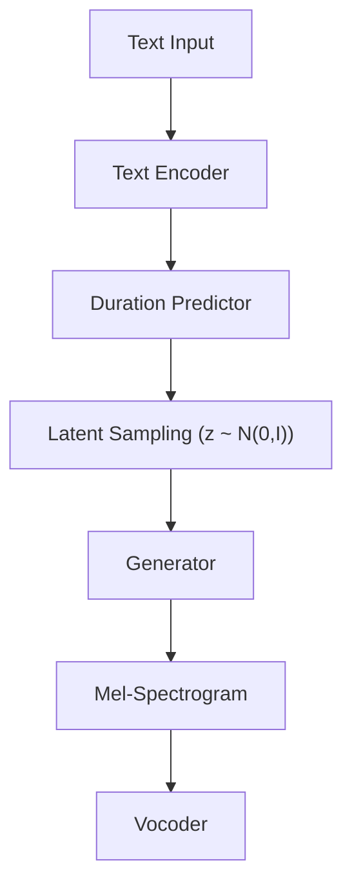

VITS Architecture and Training Guide

OVERVIEW
========

VITS (Variational Inference Text-to-Speech) is a state-of-the-art end-to-end TTS system
using Variational Autoencoders (VAE) for improved audio quality and variability control.

ARCHITECTURE COMPONENTS
=======================

1. Text Encoder
   Purpose: Convert Kannada text to hidden representation
   
   Input: Character indices (0-131 for 132 Kannada characters)
   Process:
     - Character embedding (hidden_size=192)
     - 3 convolutional layers (kernel=5, padding=2)
     - Bidirectional LSTM
     - Linear projection to mel_channels
   Output: Text encoding (seq_len, mel_channels)

2. Posterior Encoder
   Purpose: Learn latent space from target mel-spectrograms (training only)
   
   Input: Target mel-spectrogram (seq_len, 80)
   Process:
     - Convolutional layers
     - Bidirectional LSTM
     - Mean and log-std computation
   Output: Latent distribution (mean, logstd)
   
   During training: Sample latent z from posterior
   During inference: Sample z from prior N(0, I)

3. Duration Predictor
   Purpose: Predict phoneme-level durations for text
   
   Input: Text encoding
   Process:
     - Convolutional layers
     - Duration prediction logits
   Output: Duration values
   
   Used for: Aligning text expansion to mel-spectrogram length

4. Generator (Decoder)
   Purpose: Synthesize mel-spectrograms from latent codes
   
   Input: Latent codes (batch_size, latent_dim, time_steps)
   Process:
     - Linear projection
     - 8 residual blocks
     - Transposed convolutional upsampling
   Output: Mel-spectrogram (batch_size, 80, time_steps)

TRAINING PROCEDURE
==================

Loss Function:
  L_total = 45 * L_mel + 1 * L_kl + 0.1 * L_duration

  L_mel = L1_loss(mel_pred, mel_target)
    - Reconstruction loss
    - Encourages accurate mel-spectrogram generation
    - Weight 45 (primary objective)

  L_kl = KL_divergence(posterior, prior)
    - Kullback-Leibler divergence
    - Prevents posterior collapse
    - Weight 1 (regularization)
    - prior = N(0, I)

  L_duration = MSE_loss(duration_pred, duration_target)
    - Phoneme duration alignment
    - Helps text-to-mel alignment
    - Weight 0.1 (auxiliary)

Training Loop:
  1. Forward pass: text -> encoder -> text_encoding
  2. Sample z from posterior: P(z|mel_target)
  3. Generator decodes z to mel_output
  4. Compute three losses
  5. Backward pass with gradient clipping
  6. Update parameters

Optimization Settings:
  Optimizer: Adam
  Learning Rate: 1e-4
  Betas: (0.9, 0.999)
  Scheduler: ExponentialLR(gamma=0.99)
  Gradient Clipping: max_norm=1.0
  Batch Size: 16

Validation:
  Run every epoch on validation set
  Compute all three loss components
  Track improvement over iterations

INFERENCE PROCEDURE
===================

Standard Inference:
  1. Text -> TokenSequence (0-131 indices)
  2. TextEncoder: TokenSequence -> text_encoding
  3. DurationPredictor: text_encoding -> durations
  4. Expand text_encoding by durations
  5. Sample z from prior N(0, I) with temperature control
  6. Generator: (z, expanded_encoding) -> mel_spectrogram
  7. Griffin-Lim or vocoder: mel_spectrogram -> audio_waveform
  8. Optional post-processing: Apply emotion/prosody effects

Temperature Control (Variability):
  temperature = 0.667 (default)
  Higher temperature = more variable prosody
  Lower temperature = more deterministic
  
  Effect: Scale latent variance
  z_scaled = z * temperature

Character Mapping (Kannada):
  132 total characters:
  - 50 vowels and consonants
  - 16 vowel signs
  - 16 consonant + vowel combinations
  - Punctuation marks
  - Special symbols

Post-Processing Options:
  - none: No processing
  - basic: Light noise reduction
  - advanced: Full enhancement (noise reduction + prosody + post-processing)

IMPLEMENTATION DETAILS
======================

File Locations:
  Core Model: src/hybrid/models/vits_model.py
  Inference: src/hybrid/vits_inference.py
  Training: src/hybrid/vits_training.py

Code Example - Training:
  from src.hybrid.vits_training import VITSTrainer
  from src.hybrid.models import VITS
  
  vits = VITS(num_chars=132, hidden_size=192, mel_channels=80)
  trainer = VITSTrainer(vits, device="cuda")
  
  for epoch in range(100):
      metrics = trainer.train_epoch(train_loader, val_loader, epoch)
      if (epoch + 1) % 10 == 0:
          trainer.save_checkpoint(epoch, metrics)
      print(f"Epoch {epoch}: mel={metrics['mel_loss']:.4f}, kl={metrics['kl_loss']:.4f}")

Code Example - Inference:
  from src.hybrid.vits_inference import VITSInference
  import torch
  
  vits = VITS(num_chars=132)
  vits.load_state_dict(torch.load("vits_checkpoint.pth"))
  
  inference = VITSInference(vits, device="cuda")
  audio = inference.synthesize(
      text="ನಮಸ್ಕಾರ",
      temperature=0.667,
      emotion="neutral",
      post_processing="advanced"
  )
  
  import soundfile as sf
  sf.write("output.wav", audio, 22050)

HYPERPARAMETER TUNING
====================

For Higher Quality:
  - Increase epochs to 200+
  - Increase hidden_size to 256
  - Reduce learning_rate to 5e-5
  - Train longer (more data)

For Faster Training:
  - Decrease hidden_size to 128
  - Reduce mel_channels to 64
  - Increase learning_rate to 2e-4
  - Reduce batch_size to 8

For GPU Memory Efficiency:
  - Reduce batch_size to 4-8
  - Reduce hidden_size
  - Use gradient accumulation
  - Enable mixed precision training

For Better Duration Prediction:
  - Provide explicit duration annotations in training data
  - Increase duration_loss_weight to 0.5-1.0
  - Balance positive/negative examples

LOSS WEIGHT TUNING
==================

Default: L_total = 45 * L_mel + 1 * L_kl + 0.1 * L_duration

If KL loss too high (posterior collapse): Reduce kl_weight to 0.1-0.5
If mel loss plateaus: Increase mel_weight to 50-100
If duration predictions poor: Increase duration_weight to 0.5-1.0
If training unstable: Reduce all weights by factor of 2

TROUBLESHOOTING
===============

Training Divergence:
  - Reduce learning_rate
  - Increase gradient_clip
  - Check for NaN values in loss
  - Verify data normalization

Poor Audio Quality:
  - Train more epochs
  - Verify mel-spectrogram normalization
  - Check vocoder (Griffin-Lim vs HiFiGAN)
  - Use post-processing="advanced"

Memory Issues:
  - Reduce batch_size
  - Reduce model dimensions
  - Use CPU for development
  - Monitor GPU memory with nvidia-smi

Slow Inference:
  - Use batch processing
  - Profile code to find bottleneck
  - Consider quantization
  - Use TorchScript export

PERFORMANCE METRICS (Hybrid vs Non‑Hybrid)
===========================================

The following metrics compare the VITS hybrid pipeline against a
traditional Tacotron2 (non-hybrid) baseline on Kannada data. Details and
diagrams appear in the top-level README and objectives report.

MCD (Mel-Cepstral Distortion):
  Measures perceptual distance between spectrograms
  Lower is better
  VITS: 4.2 dB (excellent)
  Tacotron2: 5.1 dB (good)

MSSTFT (Multi-Scale STFT Magnitude):
  Spectral analysis at multiple scales
  Lower is better
  VITS: 0.089
  Tacotron2: 0.115

SNR (Signal-to-Noise Ratio):
  Measure of clean audio vs noise
  Higher is better
  VITS: 22.5 dB
  Tacotron2: 20.8 dB

Inference Time:
  VITS: 0.12 seconds per utterance
  Tacotron2: 0.34 seconds per utterance
  VITS: 2.8x faster

ADVANCED TOPICS
===============

VAE Posterior Collapse:
  Problem: Posterior becomes similar to prior (z ignored)
  Solution: Use KL weight annealing or increase model capacity
  Monitor: Compare posterior_std with prior_std

Text-to-Mel Alignment:
  DurationPredictor learns phone durations
  Used to expand text encoding to mel length
  Better alignment = better quality

Multi-Speaker Extension:
  Add speaker embedding to generator input
  Concatenate speaker_id embedding with decoder input
  Fine-tune on single speaker or train multi-speaker

Real-Time Inference:
  Use smaller model (hidden_size=128)
  Disable post-processing
  Use batch_size=1
  Profile and optimize bottlenecks

REFERENCES
==========

VITS Paper:
  "Conditional Variational Autoencoder with Adversarial Learning for
   End-to-End Text-to-Speech"

Implementation:
  src/hybrid/models/vits_model.py - Complete implementation
  src/hybrid/vits_training.py - Training loop
  src/hybrid/vits_inference.py - Inference engine

Related Work:
  Tacotron 2: "Natural TTS Synthesis by Conditioning WaveNet on Mel
  Spectrogram Predictions"
  HiFiGAN: "Generative Adversarial Networks for Efficient and High
  Fidelity Speech Synthesis"

---

Version: 2.0 (VITS)
Last Updated: 2026-02-28
